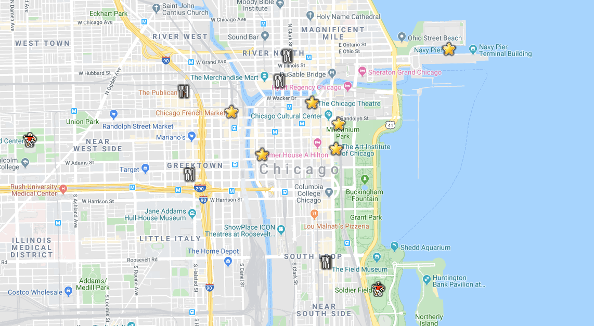

# Places

**Places** is a web application backed by the power of the power, performance, and simplicity of [MariaDB](https://mariadb.com/), allows you to record all of your favorite locations using both structured (relational) and semi-structured (JSON) data!

<p align="center" spacing="10">
    <kbd>
        
    </kbd>
</p>

This application is made of two parts:

* Client
    - web UI that communicates with REST endpoints available through an API app (see below).
    - is a React.js project located in the [client](src/client) folder.
* API
    - uses [MariaDB Connector/J (JDBC)](https://github.com/mariadb-corporation/mariadb-connector-j) with [Spring](https://spring.io/) ([Spring Boot](https://spring.io/projects/spring-boot) and [Data](https://spring.io/projects/spring-data)) to connect to MariaDB.
    - is a Java (Maven-based) project located in the [api](src/api) folder.

This README will walk you through the steps for getting the `Places` web application up and running using MariaDB.

# Table of Contents
1. [Requirements](#requirements)
2. [Getting started with MariaDB and JSON](#mariadb)
3. [Get the code](#code)
4. [Configure, build and run the apps](#app)
    1. [Configure](#configure-api-app)
    2. [Build and run the API app](#build-run-api)
    3. [Build and run the Client app](#build-run-client)
5. [JSON Data Models](#data-models)
6. [Support and contribution](#support-contribution)
7. [License](#license)

## Requirements <a name="requirements"></a>

This sample application requires the following to be installed/enabled on your machine:

* [Java 8+](https://www.java.com/en/download/)
* [Maven v.3+](https://maven.apache.org/)
* [Node.js (v. 12+)](https://nodejs.org/docs/latest-v12.x/api/index.html) (for the Client/UI app)
* [NPM (v. 6+)](https://docs.npmjs.com/) (for the Client/UI app)
* [MariaDB command-line client](https://mariadb.com/products/skysql/docs/clients/mariadb-clients/mariadb-client/) (optional), used to connect to MariaDB database instances.

## 1.) Getting Started with MariaDB and JSON <a name="mariadb"></a>

Set up a MariaDB database, loaded with the data this sample needs, using the [MariaDB JSON Quickstart](https://github.com/mariadb-developers/mariadb-json-quickstart), before continuing to the next step.

## 2.) Get the code <a name="code"></a>

First, use [git](git-scm.org) (through CLI or a client) to retrieve the code using `git clone`:
Ts
```
$ git clone https://github.com/mariadb-developers/places-app-nodejs.git
```

Next, because this repo uses a [git submodule](https://git-scm.com/book/en/v2/Git-Tools-Submodules), you will need to pull the [client application](https://github.com/mariadb-developers/todo-app-client) using:

```bash
$ git submodule update --init --recursive
```

## 3.) Configure, Build and Run the App <a name="app"></a>

This application is made of two parts:

* Client
    - web UI that communicates with REST endpoints available through an API app (see below).
    - is a React.js project located in the [client](src/client) folder.
* API
    - uses [MariaDB Connector/J (JDBC)](https://github.com/mariadb-corporation/mariadb-connector-j) with [Spring](https://spring.io/) ([Spring Boot](https://spring.io/projects/spring-boot) and [Data](https://spring.io/projects/spring-data)) to connect to MariaDB.
    - is a Java (Maven-based) project located in the [api](src/api) folder.

The following steps, `a` through `c`, will walk you through the process of configuring, building and running the `api` and `client` applications.

### a.) Configure the app <a name="configure-app"></a>

Configure the MariaDB connection with your connection details in [application.properties](src/api/main/resources).

Example implementation:

```
spring.datasource.url=jdbc:mariadb://localhost:3306/todo
spring.datasource.username=root
spring.datasource.password=Password123!
spring.datasource.driver-class-name=org.mariadb.jdbc.Driver
```

### b.) Build and run the Java [API app](src/api) <a name="build-run-api"></a>

Once you have retrieved a copy of the code you're ready to build and run the project! Start by opening a terminal and navigating to the root of the [api](src/api) folder, then...

i. Build the project by executing the following CLI command:

```
$ mvn package
```

ii. Run the project by executing the following CLI command:

```bash
$ mvn spring-boot:run
```

### c.) Build and run the [UI (Client) app](src/client) <a name="build-run-client"></a>

Once the API project is running you can now communicate with the exposed endpoints directly (via HTTP requests) or with the application UI, which is contained with the [client](src/client) folder of this repo.

To start the [client](src/client) application follow the instructions [here](https://github.com/mariadb-developers/places-app-client).

## JSON Data Models <a name="data-models"></a>

Below are samples of the data model per Location Type. 

**Attraction (A)**
```json
{
   "category":"Landmark",
   "lastVisitDate":"11/5/2019"
}
```

**Restuarant (R)**
```json
{
   "details":{
      "foodType":"Pizza",
      "menu":"www.giodanos.com/menu"
   },
   "favorites":[
      {
         "description":"Classic Chicago",
         "price":24.99
      },
      {
         "description":"Salad",
         "price":9.99
      }
   ]
}
```

**Sports Venue (S)**
```json
{
   "details":{
      "yearOpened":1994,
      "capacity":23500
   },
   "events":[
      {
         "date":"10/18/2019",
         "description":"Bulls vs Celtics"
      },
      {
         "date":"10/21/2019",
         "description":"Bulls vs Lakers"
      },
      {
         "date":"11/5/2019",
         "description":"Bulls vs Bucks"
      },
      {
         "date":"11/5/2019",
         "description":"Blackhawks vs Blues"
      }
   ]
}
```

## Support and Contribution <a name="support-contribution"></a>

Please feel free to submit PR's, issues or requests to this project project directly.

If you have any other questions, comments, or looking for more information on MariaDB please check out:

* [MariaDB Developer Hub](https://mariadb.com/developers)
* [MariaDB Community Slack](https://r.mariadb.com/join-community-slack)

Or reach out to us diretly via:

* [developers@mariadb.com](mailto:developers@mariadb.com)
* [MariaDB Twitter](https://twitter.com/mariadb)

## License <a name="license"></a>
[](https://opensource.org/licenses/MIT)
